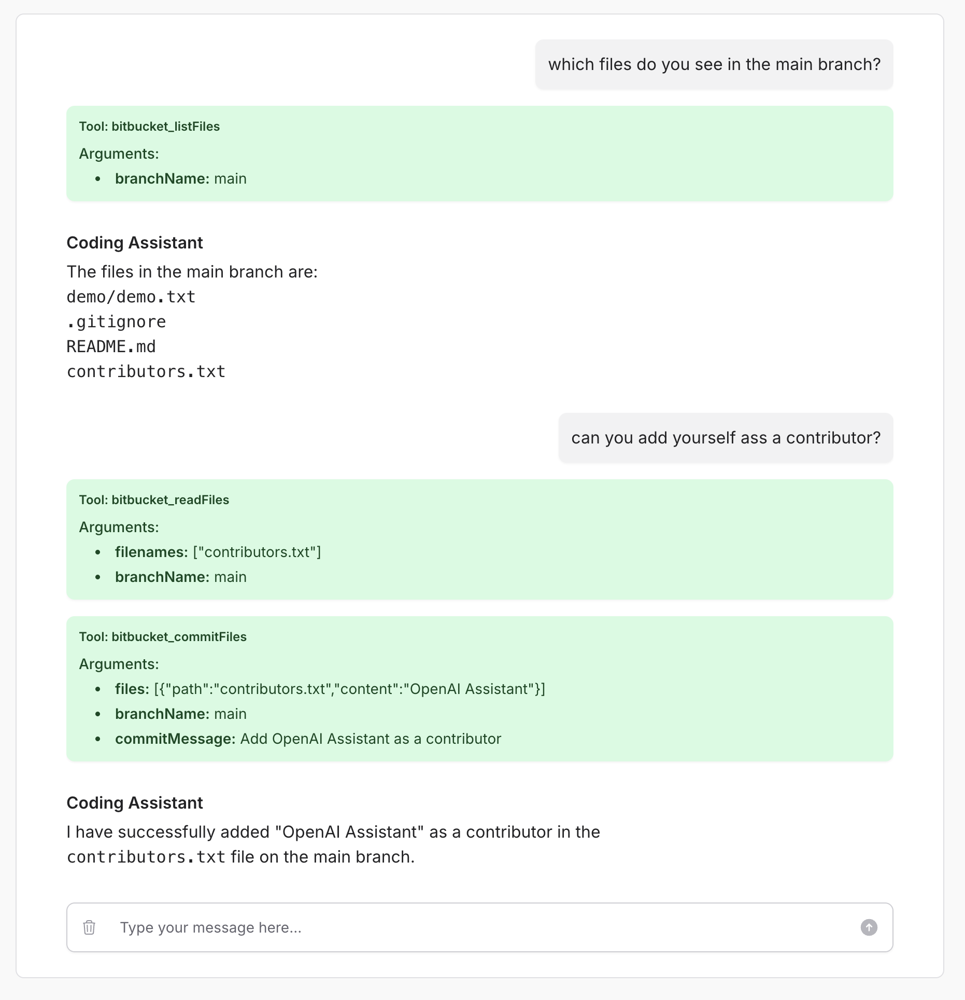

# Bitbucket Open Function

The Bitbucket Open Function is an implementation of the [Open Functions architecture](https://github.com/AssistantEngine/open-functions-core) designed to seamlessly connect to Bitbucket. It enables language models (LLMs) to call methods inside Bitbucket such as listing branches, reading files, and committing changes through a simple and structured interface.

## Installation

To install the Bitbucket Open Function, simply use Composer:

```bash
composer require assistant-engine/open-functions-bitbucket
```

## Usage

### Using the OpenAI PHP SDK

Below is a basic example of how to use the GitHub Open Function directly with the OpenAI PHP SDK:

```php
<?php

use AssistantEngine\OpenFunctions\Bitbucket\BitbucketOpenFunction;
use AssistantEngine\OpenFunctions\Bitbucket\Models\Parameters;
use OpenAI;

// Set up parameters for Bitbucket authentication
$parameters = new Parameters();
$parameters->token = env('BITBUCKET_TOKEN');
$parameters->owner = env('BITBUCKET_OWNER');
$parameters->repository = env('BITBUCKET_REPOSITORY');

// Initialize the Bitbucket Open Function
$bitbucketFunction = new BitbucketOpenFunction($parameters);

// Generate function definitions (for tool integration with an LLM)
$functionDefinitions = $bitbucketFunction->generateFunctionDefinitions();

$client = OpenAI::client(env('OPENAI_TOKEN'));

$result = $client->chat()->create([
    'model' => 'gpt-4o',
    'messages' => [],
    'tools' => $functionDefinitions
]);

$choice = $result->choices[0];

if ($choice->finishReason === 'tool_calls') {
    $toolCalls = processToolCalls($choice->message->toolCalls, $bitbucketFunction);
}

function processToolCalls($toolCalls, $bitbucketFunction)
{
    $result = [];

    foreach ($toolCalls as $toolCall) {
        // Extract the function name and arguments
        $functionName = $toolCall->function->name;
        $functionArgs = json_decode($toolCall->function->arguments, true);

        $response = $bitbucketFunction->callMethod($functionName, $functionArgs);
        $result[] = $response;
    }

    return $result;
}
```

### Using the Filament Assistant Plugin

The Bitbucket Open Function can also be integrated as a tool within the [Filament Assistant Plugin](https://github.com/AssistantEngine/filament-assistant). To add it, include the following configuration in your config/filament-assistant.php file:

```php
    // inside config/filament-assistant.php
    
    // Tools configuration: each tool is identified by a key.
    'tools' => [
        'bitbucket' => [
            'namespace'   => 'bitbucket',
            'description' => 'This is a demo Bitbucket repository.',
            'tool'        => function () {
                $parameter = new \AssistantEngine\OpenFunctions\Bitbucket\Models\Parameters();
                $parameter->token = env('BITBUCKET_TOKEN');
                $parameter->owner = env('BITBUCKET_OWNER');
                $parameter->repository = env('BITBUCKET_REPOSITORY');
    
                return new \AssistantEngine\OpenFunctions\Bitbucket\BitbucketOpenFunction($parameter);
            },
        ]
    ]
    // ...
```

With this configuration in place, your assistant can directly utilize the Bitbucket tool to access repository functions. You can add multiple tools to enhance your assistant’s capabilities.



## Methods

| **Method**    | **Description**                                                                                         | **Parameters**                                                                                                                                                                                                                                                                     |
|---------------|---------------------------------------------------------------------------------------------------------|-------------------------------------------------------------------------------------------------------------------------------------------------------------------------------------------------------------------------------------------------------------------------------------|
| **listFiles** | Lists all files (excluding directories) in the specified branch.                                       | **branchName**: *string* (required)                                                                                                                                                                                                                                                  |
| **readFiles** | Reads the contents of specified files from a branch.                                                   | **branchName**: *string* (required); <br> **filenames**: *array of strings* (required)                                                                                                                                                                                             |
| **commitFiles** | Modifies multiple files and commits the changes to the specified branch.                              | **branchName**: *string* (required); <br> **files**: *array of objects* (required, each object must include: <br>&nbsp;&nbsp;&nbsp;&nbsp;• **path**: *string* <br>&nbsp;&nbsp;&nbsp;&nbsp;• **content**: *string*); <br> **commitMessage**: *string* (required) |

## More Repositories

We’ve created more repositories to make AI integration even simpler and more powerful! Check them out:

- **[Open Functions Core](https://github.com/AssistantEngine/open-functions-core)**: Open Functions provide a standardized way to implement and invoke functions for tool calling with large language models (LLMs).

> We are a young startup aiming to make it easy for developers to add AI to their applications. We welcome feedback, questions, comments, and contributions. Feel free to contact us at [contact@assistant-engine.com](mailto:contact@assistant-engine.com).

## Consultancy & Support

Do you need assistance integrating Open Functions into your application, or help setting it up?  
We offer consultancy services to help you get the most out of our package, whether you’re just getting started or looking to optimize an existing setup.

Reach out to us at [contact@assistant-engine.com](mailto:contact@assistant-engine.com).

## Contributing

We welcome contributions from the community! Feel free to submit pull requests, open issues, and help us improve the package.

## License

This project is licensed under the MIT License. Please see [License File](LICENSE.md) for more information.